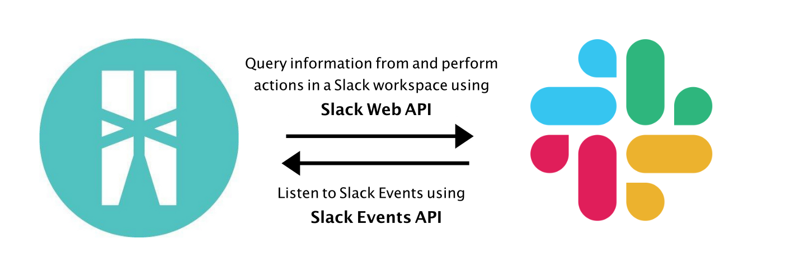
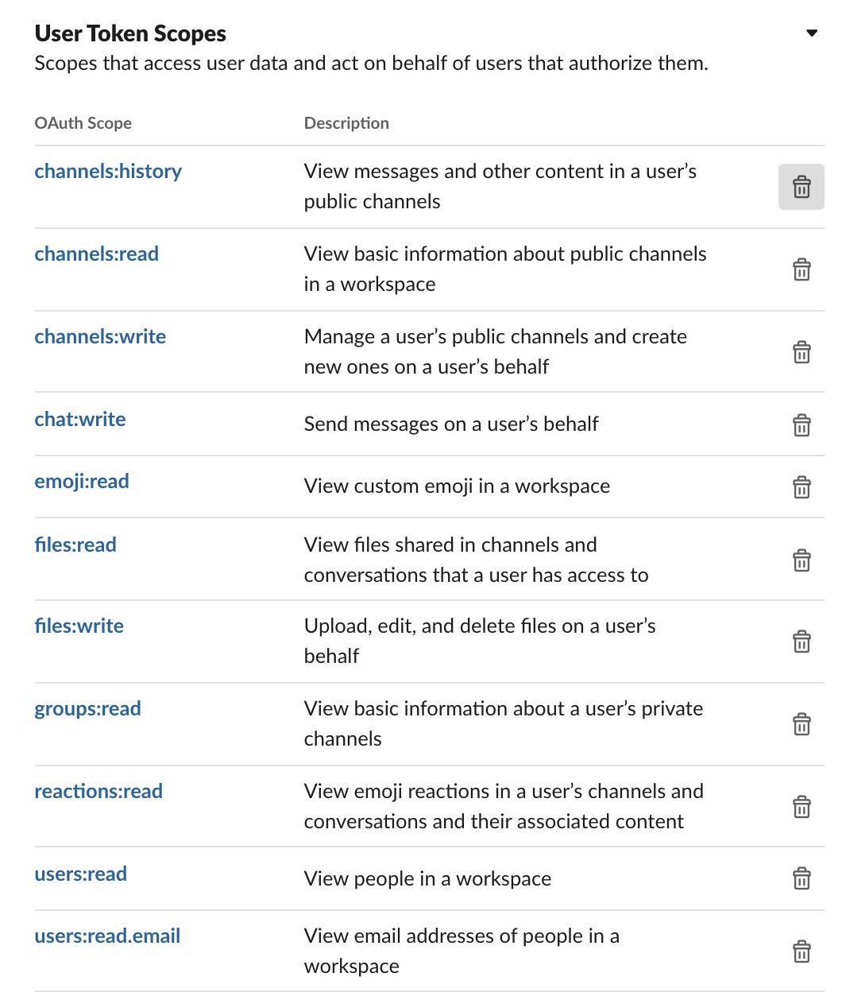
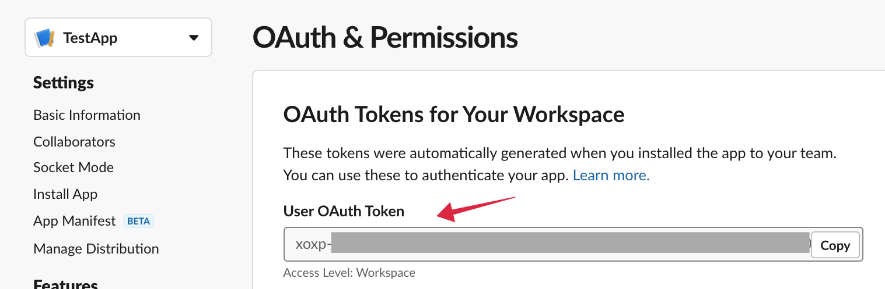
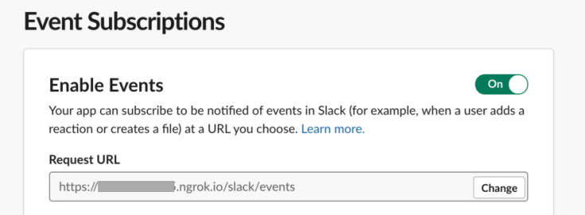
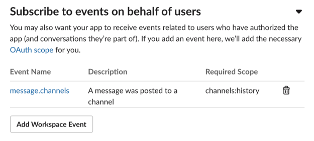

[](https://github.com/ballerina-platform/module-ballerinax-slack/actions?query=workflow%3ACI)
[](https://github.com/ballerina-platform/module-ballerinax-slack/commits/master)
[](https://opensource.org/licenses/Apache-2.0)

# Ballerina Slack Connector 
Connects to Slack using Ballerina

# Introduction
## Slack
[Slack](https://api.slack.com/) is a channel-based messaging platform. With Slack, people can work together more effectively, connect all their software tools and services, and find the information they need to do their best work — all within a secure, enterprise-grade environment.

## Connector Overview
The Ballerina Slack Connector allows you to access the Slack Web API and Slack Events API through Ballerina. This 
connector can be used to implement some of the most common use cases of Slack. This connector provides the capability
to query information from and perform some actions in a Slack workspace. This connector also allows you to listen to
Slack Events.



## Prerequisites
* Slack Account https://slack.com/get-started#/createnew

* Java 11 Installed - Java Development Kit (JDK) with version 11 is required.

* Ballerina SL Beta 3 Installed - Ballerina Swan Lake Beta 3 is required. 

## Supported Versions
|                             |           Version           |
|:---------------------------:|:---------------------------:|
| Ballerina Language          |        Swan Lake Beta 3     |

## Obtaining Slack User OAuth Token
1. Visit https://api.slack.com/apps and create a Slack App.
2. In the "Add features and functionality" section, Click permissions.
3. Go to the Scopes section and add necessary OAuth scopes for User Token.



4. Install the app to the workspace.
5. Get your User OAuth token from the OAuth & Permissions section of your Slack App.


## Module Overview - `ballerinax/slack`

The `ballerinax/slack` module provides a Slack client, which allows you to access the Slack Web API through Ballerina.

The following sections provide you details on how to use the Slack connector.

- [Feature Overview](#feature-overview)
- [Quickstart](#quickstart)
- [Samples](#samples)

## Feature Overview

1. Conducting messaging-related operations. For example, post messages on slack, delete messages, 
send attachments, etc.
2. Executing `conversations/channels`-related operations. For example, create conversations,
join a conversation, add users to a conversation, archive/unarchive conversations, etc.
3. Conducting `users/user groups`-related operations. For example, get user information etc.
4. Performing file-related operations in Slack. For example, upload files, delete files, get file information, etc.

# Quickstart

### Pull the Module
Execute the below command to pull the Slack module from Ballerina Central:
```ballerina
$ ballerina pull ballerinax/slack
```

### Slack Client Sample
The Slack Client Connector can be used to interact with the Slack Web API.

```ballerina
import ballerina/log;
import ballerinax/slack;
import ballerina/os;

slack:Configuration slackConfig = {
    bearerTokenConfig: {
        token: os:getEnv("SLACK_TOKEN")
    }
};

public function main() returns error? {
    slack:Client slackClient = check new(slackConfig);

    slack:Message messageParams = {
        channelName: "channelName",
        text: "Hello"
    };

    // Post a message to a channel.
    var postResponse = slackClient->postMessage(messageParams);
    if (postResponse is string) {
        log:printInfo("Message sent");
    } else {
        log:printError(postResponse.toString());
    }

    // List all the conversations.
    var listConvResponse = slackClient->listConversations();
    if (listConvResponse is error) {
        log:printError(listConvResponse.toString());
    } else {
        log:printInfo(listConvResponse.toString());
    }

    // Upload a file to a channel.
    var fileResponse = slackClient->uploadFile("filePath", "channelName");
    if (fileResponse is error) {
        log:printError(fileResponse.toString());
    } else {
        log:printInfo("Uploaded file " + fileResponse.id);
    }

    // Get user information.
    var userResponse = slackClient->getUserInfo("userName");
    if (userResponse is error) {
        log:printError(userResponse.toString());
    } else {
        log:printInfo("Found user information of the user ", userResponse.name);
    }
}
```
## Please check the [Samples directory](https://github.com/ballerina-platform/module-ballerinax-slack/tree/master/samples) for more examples.


## Module Overview - `ballerinax/slack.'listener`

The `ballerinax/slack.'listener` module provides a Listener to grasp event triggers from your Slack App. This functionality is provided by [Slack Event API](https://api.slack.com/apis/connections/events-api). 

## Listener Feature Overview
1. Receive event triggers and event related data from Slack
2. Validate Slack requests using the Verification token issued and automatic response to Slack API when needed.

## Supported Trigger Types
1. "onAppMention" - Subscribe to only the message events that mention your app or bot
2. "onChannelCreated" - A channel was created
3. "onEmojiChanged" - A custom emoji has been added or changed
4. "onFileShared" - A file was shared
5. "onMemberJoinedChannel" - A user joined a public or private channel
6. "onMessage" - A message was sent to a channel
7. "onReactionAdded" - A member has added an emoji reaction to an item
8. "onTeamJoin" - A new member has joined

## Quickstart

### Prerequisites
1. Create your own slack app and enable Event Subscription in your slack app settings. 
2. Subscribe to the events that you are planning to listen and save changes.
3. Obtain verification token from the Basic Information section of your Slack App.
4. Download and install [Ballerina](https://ballerinalang.org/downloads/).
5. Install npm and setup the [ngrok](https://ngrok.com/download).

### Pull the Module
Execute the below command to pull the Slack Listener module from Ballerina Central:
```ballerina
$ ballerina pull ballerinax/slack.'listener
```

### Implementation of the listener

```ballerina
import ballerina/log;
import ballerinax/slack.'listener as slack;

slack:ListenerConfiguration configuration = {
    port: 9090,
    verificationToken: "VERIFICATION_TOKEN"
};

listener slack:Listener slackListener = new (configuration);

service /slack on slackListener {
    isolated remote function onMessage(slack:MessageEvent eventInfo) returns error? {
        log:printInfo("New Message");
        log:printInfo(eventInfo.toString());
    }
}
```

* Write a remote function to receive particular event type. Implement your logic within that function.

* "onAppMention", "onChannelCreated", "onEmojiChanged", "onFileShared", "onMemberJoinedChannel", "onMessage",
"onReactionAdded", "onTeamJoin" are the supported event types.

### Register the Request URL
1. Run your ballerina service (similar to below sample) on prefered port.
2. Start ngok on same port using the command ``` ./ngrok http 9090 ```
3. In Event Subscriptions section of your Slack App settings, paste the URL issued by ngrok following with your service path (eg : ```https://365fc542d344.ngrok.io/slack/events```) 

4. Slack Event API will send a url_verification event containing the token and challenge key value pairs.
5. Slack Listener will automatically verify the URL by comparing the token and send the required response back to slack 
6. Check whether your Request URL displayed as verified in your Slack.
7. Subscribe to the events that you are planning to listen and click save changes.


### Receiving events
* After successful verification of Request URL your ballerina service will receive events. 

## Samples

### Slack Listener Sample
* Following sample code is written to receive triggered event data from Slack Event API.
* Name of the remote functions written within the service must be one of the supported trigger type.
   Example: "onAppMention", "onChannelCreated", "onEmojiChanged", "onFileShared", "onMemberJoinedChannel", "onMessage",
   "onReactionAdded", "onTeamJoin"

```ballerina
import ballerina/log;
import ballerinax/slack.'listener as slack;

slack:ListenerConfiguration configuration = {
    port: 9090,
    verificationToken: "VERIFICATION_TOKEN"
};

listener slack:Listener slackListener = new (configuration);

service /slack on slackListener {
    isolated remote function onMessage(slack:MessageEvent eventInfo) returns error? {
        log:printInfo("New Message");
        log:printInfo(eventInfo.toString());
    }
}
```

## Please check the [Samples directory](https://github.com/ballerina-platform/module-ballerinax-slack/tree/master/samples) for more examples.


## Building from the Source

### Setting Up the Prerequisites

1. Download and install Java SE Development Kit (JDK) version 11 (from one of the following locations).

   * [Oracle](https://www.oracle.com/java/technologies/javase-jdk11-downloads.html)

   * [OpenJDK](https://adoptopenjdk.net/)

        > **Note:** Set the JAVA_HOME environment variable to the path name of the directory into which you installed JDK.

2. Download and install [Ballerina SL Beta 3](https://ballerina.io/). 

### Building the Source

Execute the commands below to build from the source after installing Ballerina SL Beta 3.

1. To build the ballerina package:
```shell script
    bal build
```

2. To build the ballerina package without the tests:
```shell script
    bal build --skip-tests
```

## Issues 

To report bugs, request new features and start new discussions etc, please create issues in
[Issues](https://github.com/ballerina-platform/module-ballerinax-slack/issues). 


## Contributing to Ballerina

As an open source project, Ballerina welcomes contributions from the community. 

For more information, go to the [contribution guidelines](https://github.com/ballerina-platform/ballerina-lang/blob/master/CONTRIBUTING.md).

## Code of Conduct

All the contributors are encouraged to read the [Ballerina Code of Conduct](https://ballerina.io/code-of-conduct).

## Useful Links

* Discuss the code changes of the Ballerina project in [ballerina-dev@googlegroups.com](mailto:ballerina-dev@googlegroups.com).
* Chat live with us via our [Slack channel](https://ballerina.io/community/slack/).
* Post all technical questions on Stack Overflow with the [#ballerina](https://stackoverflow.com/questions/tagged/ballerina) tag.
